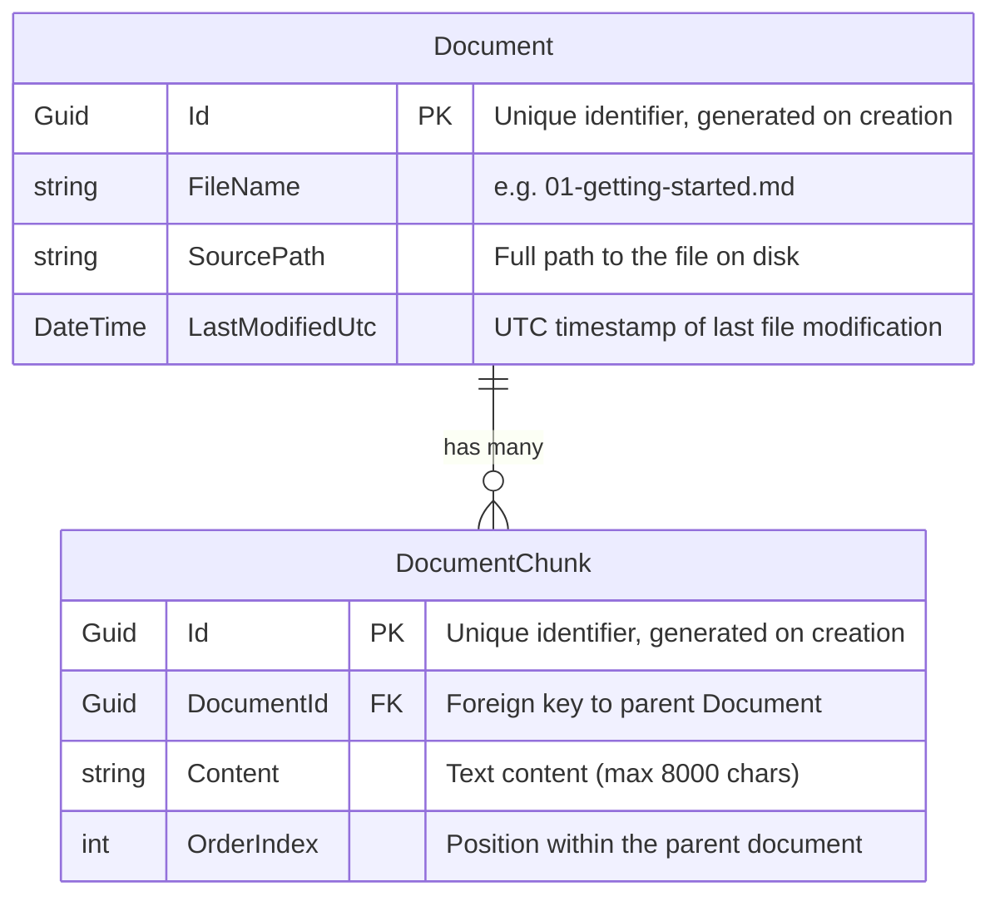
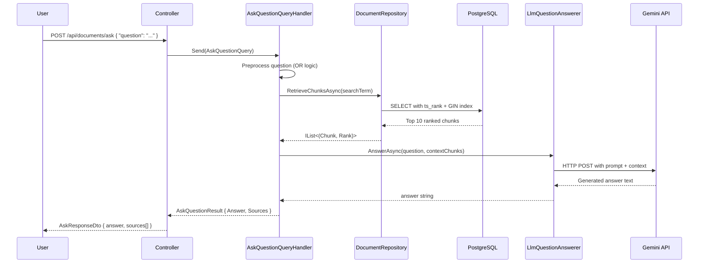

# Tech Notes & Architecture Decisions

This document describes the development journey of the DocSearch solution — its domain model, the challenges we encountered, how we solved them, and the architectural decisions we made along the way.

---

## Step 1 — Domain Modelling

The first step was defining the domain entities that represent the core concepts of the system. We approached domain modelling by asking a fundamental question: *what are the real-world concepts our system needs to represent?*

A **knowledge base** is made of **documents** (Markdown files on disk), and each document is too large to be useful as a single search result. Therefore, a document must be broken down into smaller, searchable pieces — **chunks**. This gives us a clean one-to-many relationship: one document produces many chunks.

### Domain Entity Diagram



### `Document`
Represents a single Markdown file on disk. Key properties:
- `Id` — a `Guid` generated on creation, used as the primary key.
- `FileName` — the name of the file (e.g. `01-getting-started.md`).
- `SourcePath` — the full path to the file on disk, used to locate it.
- `LastModifiedUtc` — the UTC timestamp of the file's last modification on disk (see migration history below).
- `Chunks` — a private collection of `DocumentChunk`, only accessible as a read-only collection. The only way to add a chunk is via the controlled `AddChunk(string content)` method, enforcing business rules.

### `DocumentChunk`
Represents a logical section of a document's text. Key properties:
- `Id` — its own `Guid`.
- `DocumentId` — foreign key linking back to the parent `Document`.
- `Content` — the text of the chunk, with a hard limit of **8000 characters** enforced at the domain level.
- `OrderIndex` — the position of this chunk within the parent document.

### Why These Entities?

The entities were designed following **Domain-Driven Design (DDD)** principles:

- **Encapsulation**: `Document` owns the `_chunks` private collection. External code cannot directly manipulate chunks — it must go through `AddChunk(string content)`, which enforces validation rules (non-empty content). This protects invariants.
- **Immutability**: All setters are `private set`, preventing accidental mutation from outside the entity.
- **Internal constructors**: `DocumentChunk`'s constructor is `internal`, meaning only `Document.AddChunk()` can create chunks. This guarantees that every chunk belongs to a parent document and has a valid `OrderIndex`.
- **Business rules in the domain**: Max content length (8000 chars) and positive `OrderIndex` are enforced in the constructors, not in the database or the application layer. This is a core DDD practice — the domain protects itself.

### Relationship & Cascade Delete

The relationship is a **one-to-many cascade**: deleting a `Document` automatically deletes all its `DocumentChunks`. This is configured in `AppDbContext.OnModelCreating` via `OnDelete(DeleteBehavior.Cascade)`.

### Migration History

**`InitialCreate`** — Created the `Documents` and `DocumentChunks` tables with the core schema: `Id`, `FileName`, `SourcePath` for `Document`; `Id`, `DocumentId`, `Content`, `OrderIndex` for `DocumentChunk`.

**`V2`** — Added the `LastModifiedUtc` column to the `Documents` table. This column was not part of the initial design — it became necessary as a result of the incremental ingestion strategy (detailed in Step 3). It replaced an earlier approach of using a SHA-256 `FileHash` to detect file changes.

---

## Step 2 — The First Ingestion Endpoint (and the Bug)

The initial implementation of the ingestion endpoint called `_ingestionService.GetAllDocuments()` and passed the result to `Ok()`. This caused an immediate runtime error:

> `System.InvalidOperationException: The type 'System.Threading.ExecutionContext&' ... is invalid for serialization`

**Root Cause:** The `await` keyword was missing. Without it, the `Task` object itself — rather than its resolved result — was passed to `Ok()`. The JSON serializer then tried to serialize the internal state of the `Task`, which contains non-serializable types like `ExecutionContext&`.

**Fix:** Added `await` to the call. A simple fix, but a good reminder that missing `await` causes confusing, non-obvious errors at the serialization boundary.

---

## Step 3 — The Incremental Ingestion Challenge

The naive approach was to read all documents from disk and persist them on every call. This creates two immediate problems:
1. **Duplicate data** — re-running ingestion would insert the same documents again and again.
2. **Unnecessary work** — with thousands of files, processing unchanged documents is wasteful.

### Strategy: Identity via `FileName + LastModifiedUtc`

We evaluated two approaches to detect whether a file had changed:

| Approach | Pro | Con |
|---|---|---|
| SHA-256 Hash | Detects content changes exactly | Requires reading the entire file, expensive at scale |
| `LastModifiedUtc` | `O(1)` OS metadata call, very cheap | Relies on the OS timestamp being updated on save |

We chose `LastModifiedUtc`. It is the standard approach used by build systems, file watchers, and sync tools. The OS always updates this timestamp when a file is written, making it a reliable change indicator for our use case.

The ingestion logic became a clean, readable 5-step process:
1. Fetch existing documents from the DB and build a `HashSet<string>` of `{FileName}_{LastModifiedUtc}` keys.
2. List all `.md` files on disk and filter out any whose key is already in the `HashSet`.
3. If no new files remain, exit early — no work to do.
4. Pass the list of new file paths to the `IDocumentReader`, which reads each file and splits it into chunks.
5. Persist the resulting documents to the database.

---

## Step 4 — Scaling Challenge: Memory Under Load

The first working version of Step 4 collected all new documents into a `List<Document>` in memory before persisting them. With 6 files this works. With 100,000 files, the server would run out of RAM.

### Solution: Streaming (`IAsyncEnumerable`) + Batch Persistence

We kept the ingestion logic in the service unchanged and only changed the mechanics of how data flows through it:

**`MarkdownDocumentReader`** now implements `IAsyncEnumerable<Document>` using `yield return`. Instead of building an in-memory list, it produces one document at a time as it reads each file from disk. This is a lazy evaluation pattern — no document is read until the consumer requests it.

> **Why not multithreading?** We considered using `Parallel.ForEachAsync` or `Task.WhenAll` to read multiple files concurrently. However, for this project `IAsyncEnumerable` with sequential reads is sufficient. The I/O bottleneck is the database persistence, not file reading. Multithreading would add complexity (thread-safety concerns, connection pool contention) without meaningful throughput gains for our use case.

**`IngestDocumentsCommandHandler`** consumes this stream with `await foreach` and accumulates documents into a temporary `batch` list. When the batch reaches **100 documents**, it is flushed to PostgreSQL via `AddRangeAsync` and the list is cleared. The application's RAM usage is therefore bounded to approximately 100 documents at any given time — regardless of the total file count.

### Persistence Optimisation: Bulk Insert with `AddRangeAsync`

Instead of calling `AddAsync` for each individual document (which would generate one SQL `INSERT` per document), we use `AddRangeAsync` on the entire batch. Entity Framework Core translates this into a single bulk `INSERT` statement containing all 100 documents and their chunks, drastically reducing the number of database round-trips.

### Chunking Strategy

During ingestion, each Markdown document is split into `DocumentChunk` entities by splitting on double newlines (`\n\n`). This divides documents by paragraph or section, producing chunks of a natural, human-readable size. The domain enforces a hard limit of **8000 characters per chunk**, which aligns with the context window limits of most embedding models and search APIs used in RAG pipelines.

---

## Step 5 — Architecture: CQRS via MediatR

As the feature matured, having `DocumentIngestionService` injected directly into the controller felt like a coupling concern. We introduced **MediatR** to enforce the **Command Query Responsibility Segregation (CQRS)** pattern cleanly.

The structure is now:

| Layer | Responsibility |
|---|---|
| **Controller** | Receives HTTP request, dispatches Command/Query via `ISender`, maps Domain → DTO, returns HTTP response |
| **Command Handler** | Owns ingestion write logic, returns a list of newly ingested `Document` entities |
| **Query Handler** | Owns read logic, returns a list of existing `Document` entities |
| **DTO (`Presentation/DTOs/`)** | Defines the shape of the API response; never exposes domain internals |

Key principles upheld:
- **Controllers are thin.** `DocumentsController` has zero business logic. It only knows about `ISender`.
- **Domain stays internal.** `Document` entities are never serialized directly. The Controller is the sole responsibility boundary for mapping Domain → `DocumentDto`.
- **Handlers are independently testable.** Each handler has a single, focused responsibility and can be unit tested in isolation with mock repositories.

---

## Step 6 — Retrieval (Full-Text Search)

With documents ingested and chunked, the next challenge was implementing the search functionality: *"given a question, find and rank the most relevant stored chunks"*.

### Strategy: PostgreSQL Native Full-Text Search (FTS)

We evaluated several approaches:
1. **Plain `LIKE '%term%'` SQL Query**: Too slow (full table scans) and too rigid (lexical exact match only, no stemming).
2. **External Vector Database / Embeddings API**: Provides semantic matching, but adds significant architectural complexity, external dependencies, and API costs.
3. **PostgreSQL Full-Text Search (FTS)**: A pragmatical middle-ground. It provides stemming (e.g., matching "configure" when searching "configuration"), handles stopwords, and calculates mathematical relevance scores natively.

We chose **Option 3 (PostgreSQL FTS)** because it perfectly aligns with the project requirement to "start simple". It avoids external dependencies while delivering lightning-fast, ranked results.

### How PostgreSQL FTS Ranking Works

PostgreSQL FTS uses a mathematical function called `ts_rank` to score how relevant a chunk is to a given query. The score is a `float` value where **higher = more relevant**. The algorithm works as follows:

1. **`to_tsvector('english', content)`** — Converts the chunk text into a **Term-Frequency Vector** (`tsvector`). This process normalises the text: it lowercases words, applies English stemming (e.g. "configurations" → "configur"), and removes stopwords (e.g. "the", "is", "a"). The result is a list of unique lexemes (word roots) and their positions within the text.

2. **`WebSearchToTsQuery('english', query)`** — Converts the user's search input into a structured **Term-Search Query** (`tsquery`). This function automatically parses unformatted user input — including quoted phrases for exact matches, hyphens for exclusions, and implicit `AND`/`OR` operators — into a boolean query that PostgreSQL can execute.

3. **`ts_rank(vector, query)`** — Computes a relevance score by examining:
   - **Term frequency**: How often the query terms appear in the chunk.
   - **Document length**: Shorter documents with the same term frequency score higher (terms are more "concentrated").
   - **Proximity**: Terms that appear closer together in the text receive a higher score.

4. **GIN Index** — A **Generalized Inverted Index** on the `SearchVector` column makes these lookups virtually instant. The GIN index is essentially a pre-built reverse lookup table: for every unique lexeme, it stores which chunks contain it and at what positions. This turns a full table scan into an index lookup — O(1) per term instead of O(n) per row.

### Implementation Details & DDD Purity

To implement FTS without leaking database concerns into our Domain layer, we used Entity Framework Core's **Shadow Properties**:

1. **Clean Domain**: `DocumentChunk.cs` remained pure. We did not add PostgreSQL-specific `tsvector` types to the domain entity.
2. **Infrastructure Configuration**: In `AppDbContext.cs`, we configured a Shadow Property `SearchVector` of type `NpgsqlTsVector` and mapped it as a `GENERATED ALWAYS AS (to_tsvector('english', "Content")) STORED` column.
3. **GIN Index**: We added a Generalized Inverted Index (GIN) on the shadow property, ensuring that searches over millions of chunks remain virtually instant.
4. **Tuple Projections**: To avoid creating unnecessary Read Models in the Application Layer, `IDocumentRepository.RetrieveChunksAsync` projects the query results directly into a C# Tuple: `IList<(DocumentChunk Chunk, float Rank)>`. The handler returns this tuple, and the Controller maps it to a pristine `SearchResultDto`.
5. **Smart Querying**: We leveraged `EF.Functions.WebSearchToTsQuery`, which automatically parses unformatted user input (including quotes for exact matches and hyphens for exclusions) and translates it into a structured boolean query that PostgreSQL can execute against the GIN index.

### Query Preprocessing: Forgiving OR Logic

Since users type natural language questions (e.g. "What is LanguageWire?"), the handler preprocesses the input before passing it to PostgreSQL. It splits the question into individual words, filters out very short words (≤ 2 characters), and joins them with `OR`. This means a question like *"What is the size?"* becomes `"What OR size"`, which produces broader, more forgiving results than a strict `AND` match. If the preprocessing yields an empty string (e.g. the question was only very short words), the original question is used as a fallback.

---

## Step 7 — Answer Endpoint (RAG with Gemini LLM)

The final feature is the **Answer endpoint** — a Retrieval-Augmented Generation (RAG) pipeline that combines the retrieval layer (Step 6) with a real Large Language Model to generate human-readable answers grounded in our documents.

### The RAG Pipeline Flow



### Step-by-Step Breakdown

1. **User sends a question** via `POST /api/documents/ask` with a JSON body containing the `question` field.

2. **Query preprocessing** — The `AskQuestionQueryHandler` splits the user's natural language question into keywords, filters out words with ≤ 2 characters, and joins them with `OR` to build a forgiving full-text search query (same logic as the Retrieval endpoint).

3. **Chunk retrieval** — The handler calls `IDocumentRepository.RetrieveChunksAsync`, which executes a PostgreSQL FTS query against the `SearchVector` GIN index. The top **10 most relevant chunks** are returned, ranked by `ts_rank` score.

4. **Early exit optimisation** — If no chunks match the query, the handler short-circuits and returns a canned message: *"I couldn't find any relevant information..."*. This avoids wasting tokens on an LLM call that would have no context to work with.

5. **LLM call** — The `Content` of each retrieved chunk is extracted and concatenated with `\n\n---\n\n` separators to form a context block. The handler then calls `IQuestionAnswerer.AnswerAsync`, passing both the original question and the context.

6. **Prompt construction** — `LlmQuestionAnswerer` builds a simple, effective prompt:
   ```
   Based on the following documents:

   {chunk1 content}

   ---

   {chunk2 content}

   Answer the question: {original question}
   ```

7. **Gemini API call** — We use the official **Google GenAI .NET client** (`Google.GenAI.Client`) to send an HTTP request to **Gemini 2.5 Flash**. The `Client` is registered as a **Singleton** in the DI container (since it is stateless and thread-safe), configured with an API key loaded from environment variables.

8. **Response mapping** — The handler wraps the LLM's text response and the source chunks into an `AskQuestionResult`. The Controller then maps this to an `AskResponseDto`, which includes both the `answer` string and a `sources` array with each chunk's `ChunkId`, `DocumentId`, `Content`, `OrderIndex`, and `Rank`.

### Why a Real LLM (Not Just a Mock)?

We implemented both a `MockQuestionAnswerer` (for testing and local development without API keys) and a `LlmQuestionAnswerer` (for production). The real Gemini integration was chosen because:
- It demonstrates the complete RAG pipeline end-to-end.
- Gemini 2.5 Flash offers fast response times and a generous free tier, making it practical for an assignment.
- The `IQuestionAnswerer` interface allows swapping implementations trivially via DI configuration — no code changes needed.

### Abstraction & Testability

The `IQuestionAnswerer` interface defines a single method: `AnswerAsync(string question, IEnumerable<string> contextChunks, CancellationToken)`. This abstraction means:
- The `AskQuestionQueryHandler` has **zero knowledge** of which LLM provider is being used. It could be Gemini, OpenAI, Anthropic, or a mock.
- In unit tests, we can inject the `MockQuestionAnswerer` to verify the handler's logic without making real HTTP calls.
- Switching LLM providers is a one-line change in `Program.cs` (the DI registration).

---

## Evaluation Plan

If we were to evaluate this system's answer quality systematically, here are three concrete approaches we would pursue:

### 1. Golden Question Set (Manual Ground Truth)

Create a set of 20–30 curated question-answer pairs from the ingested documents. For each question, manually identify the expected answer and which chunks should be retrieved. Then:
- Run each question through the `/ask` endpoint.
- Compare the retrieved chunks (by `ChunkId`) against the expected chunks — calculate **Retrieval Precision** and **Recall**.
- Compare the generated answer against the expected answer — assess factual accuracy and completeness manually or via an LLM-as-judge approach.

### 2. Retrieval-Only Metrics (Automated)

Focus purely on the retrieval layer by testing the `/retrieve` endpoint:
- For each golden question, verify that the correct chunks appear in the top-K results (e.g. top 5).
- Calculate **Mean Reciprocal Rank (MRR)**: the average of `1/rank` for the first correct chunk across all queries.
- Calculate **nDCG (normalised Discounted Cumulative Gain)**: a standard information retrieval metric that penalises relevant results appearing lower in the ranking.

### 3. Hallucination Detection

Verify the LLM's faithfulness to the provided context:
- For each answer, check whether every claim in the response can be traced back to a specific chunk in the `sources` array.
- Use a second LLM call (judge model) with a prompt like: *"Given these source documents, does the following answer contain any information not present in the sources? Answer YES or NO and quote the unsupported claim."*
- This catches the primary risk of RAG systems: the LLM fabricating information that *sounds* correct but is not grounded in the actual documents.

---

## Failure Modes & Mitigations

| Failure Mode | Impact | Mitigation |
|---|---|---|
| **FTS returns no chunks** (vocabulary mismatch) | The answer endpoint returns a canned "no results" message instead of hallucinating | Early-exit logic in `AskQuestionQueryHandler` — if `sources` is empty, the LLM is never called |
| **Gemini API is down / rate-limited** | The `/ask` endpoint throws an unhandled exception, returning a 500 | Currently caught by the controller's `try/catch`. Could be improved with Polly retry policies and circuit breakers |
| **Chunk is too large for LLM context window** | The prompt exceeds the model's token limit | Domain-level enforcement of 8000 chars per chunk + only the top 10 chunks are sent. 10 × 8000 = 80K chars ≈ 20K tokens, well within Gemini Flash's 1M context |
| **Ingestion of corrupted/empty Markdown files** | Empty chunks could pollute search results | `MarkdownDocumentReader` skips chunks that are empty or whitespace-only; `Document.AddChunk()` throws on empty content |
| **Duplicate ingestion on concurrent calls** | The same files could be ingested twice if two `POST /ingest` calls race | The `FileName + LastModifiedUtc` key check mitigates most cases. A database unique constraint or distributed lock would eliminate it entirely |
| **PostgreSQL connection pool exhaustion** | Under high concurrent load, requests queue or timeout | Default EF Core pool of 100 connections. Could be tuned via `MaxPoolSize` in the connection string |

---

## Scaling Note: From 6 to 100,000 Articles

The current architecture was designed with scale in mind from Step 4 onwards. Here is how each component would behave at 100,000 articles:

### Ingestion
- **`IAsyncEnumerable` streaming** ensures that only one document is in memory at a time during reading. RAM usage stays flat regardless of file count.
- **Batch persistence (100 docs/batch)** means 100,000 articles would be persisted in ~1,000 database round-trips — not 100,000. Each round-trip is a single bulk `INSERT` via `AddRangeAsync`.
- **Incremental detection** via `HashSet<string>` lookup is O(1) per file. Re-running ingestion after the initial load only processes truly new files.

### Retrieval
- **GIN index on `tsvector`** makes full-text search O(log n) regardless of table size. PostgreSQL's GIN index is specifically designed for millions of rows — it is the same technology used by large-scale search systems in production.
- **Top-10 limit** (`Take(10)`) ensures that even with millions of chunks, the result set is bounded and the response payload stays small.

### Answer
- **Fixed context window** — Only the top 10 chunks are sent to the LLM, regardless of how many exist. The cost per LLM call is constant, not proportional to the knowledge base size.

### What Would Need to Change at True Scale
- **Ingestion**: Add parallel file reading (`Parallel.ForEachAsync`) for CPU-bound chunking. Add a message queue (e.g. RabbitMQ) to decouple file discovery from persistence.
- **Retrieval**: Consider migrating from PostgreSQL FTS to a dedicated vector database (e.g. Qdrant, Pinecone) with semantic embeddings for better conceptual matching.
- **Infrastructure**: Horizontal scaling of the API behind a load balancer. Read replicas for PostgreSQL. Caching of frequent queries with Redis.

---

## AI Usage Log

This section documents how AI tools were used during development.

| Phase | AI Tool Used | How It Was Used |
|---|---|---|
| Domain Modelling | Gemini (via IDE) | Brainstormed entity design, discussed trade-offs between `FileHash` vs `LastModifiedUtc`, refined DDD patterns (private setters, internal constructors) |
| Ingestion Pipeline | Gemini (via IDE) | Helped design the `IAsyncEnumerable` streaming pattern, reviewed batch persistence logic, suggested the `HashSet<string>` key approach for incremental detection |
| Full-Text Search | Gemini (via IDE) | Explained PostgreSQL FTS internals (`tsvector`, `tsquery`, GIN indexes), helped configure EF Core Shadow Properties to keep the domain clean |
| Answer Endpoint | Gemini (via IDE) | Helped integrate the Google GenAI .NET client, designed the prompt structure, implemented the `IQuestionAnswerer` abstraction |
| Debugging | Gemini (via IDE) | Diagnosed the missing `await` serialization bug, helped troubleshoot EF Core migration issues |
| Documentation | Gemini (via IDE) | Assisted in structuring and writing this `Notes.md` file, reviewed technical accuracy of explanations |

**Philosophy**: AI was used as a **pair programming partner** — providing suggestions, explaining concepts, and accelerating implementation. All architectural decisions, code structure, and final implementations were reviewed, understood, and validated by the developer.

---

## What We'd Do Next

If this project were to continue beyond the assignment scope, here are the improvements we would prioritise:

1. **Structured Error Handling** — Replace `try/catch` blocks with a global exception handling middleware. Introduce `Result<T>` types in the Application Layer to represent success/failure without exceptions.

2. **Resilience (Polly)** — Add retry policies, circuit breakers, and timeouts around the Gemini API calls. If the LLM is down, the system should degrade gracefully (e.g. return only the raw chunks).

3. **Logging & Observability** — Add structured logging with Serilog. Log every ingestion run (files processed, time taken), every search query (term, result count, latency), and every LLM call (tokens used, latency). Integrate with a monitoring stack (e.g. Seq, Grafana).

4. **CI/CD Pipeline** — Set up GitHub Actions to run tests on every PR, build Docker images, and deploy to a staging environment automatically.

5. **Unit & Integration Tests** — Add unit tests for all handlers with mocked repositories. Add integration tests against a real PostgreSQL instance (using Testcontainers) to verify the FTS queries and GIN index behaviour.

6. **Semantic Search (Embeddings)** — Replace or complement PostgreSQL FTS with vector embeddings. Use a model like `text-embedding-004` to generate embeddings at ingestion time and store them in a vector database. This would enable true semantic search (matching by meaning, not just keywords).

7. **Prompt Engineering** — Improve the LLM prompt with system instructions, output format constraints (e.g. JSON), and few-shot examples to improve answer quality and consistency.

8. **Authentication & Rate Limiting** — Protect the API with API keys or JWT authentication. Add rate limiting to prevent abuse of the LLM endpoint.

9. **Document Management** — Add endpoints to list, delete, and re-ingest specific documents. Currently, documents can only be added, not removed or updated selectively.

10. **Caching** — Cache frequent search queries and their LLM answers with Redis. Invalidate the cache when new documents are ingested.
